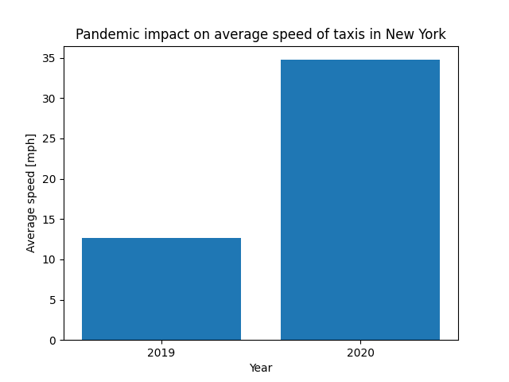

# ASEiED Project

Simple overview of use/purpose.

## Description

Visualising pandemic impact on average speed of taxis in New York

## Executing program

After you connect to your EMR execute following commands to start this program
```
aws s3 cp s3://testaseied/aseied.py .
sudo pip3 install matplotlib
spark-submit aseied.py
```

## Reviewing results and final thoughts



As we can see thanks to the pandemic road traffic severly droped nearly tripling average speed of taxis in New York
Thanks to Spark and AWS working with such a huge amount of data was a breeze